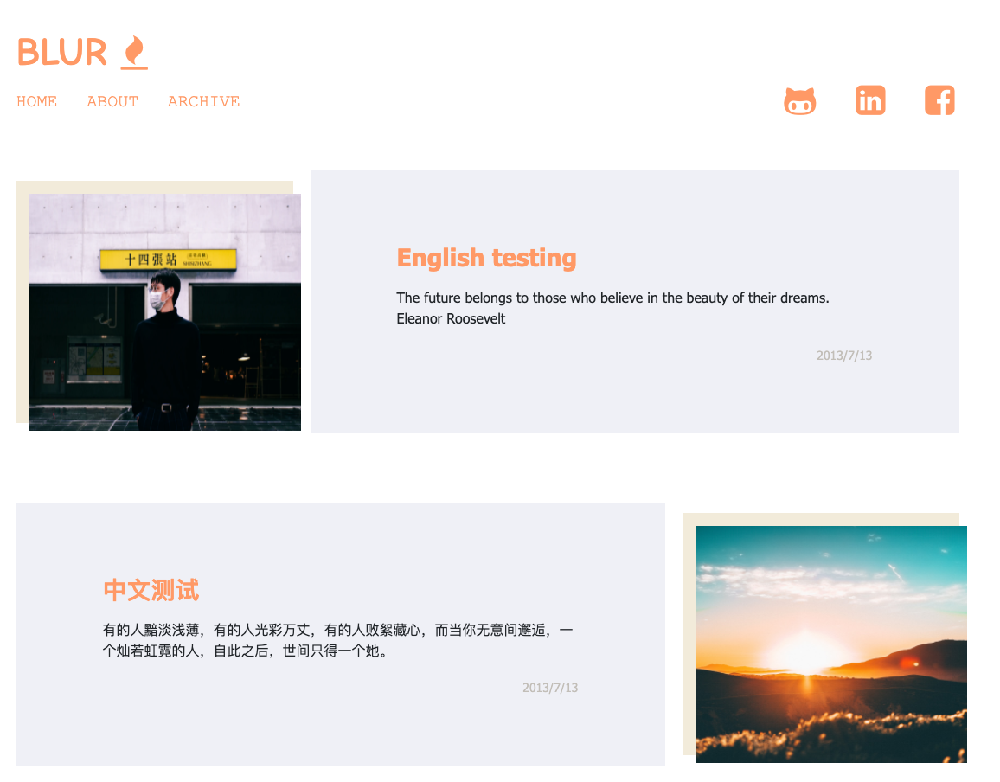

hexo-theme-blur: a easy and minimalist hexo blog theme.
================



### 在线预览(Demo)
[Demo](https://kiten46087.github.io)

### 使用说明(Usage)

1. `copy`本`repo`至主目录的`themes`下，更改主目录`_config.yml`中的`theme`为`blur`
2. 每一篇`post`设置为
  ```
  ---
  title: your title
  excerpt: description of the post
  image_url: cover photo of the post
  date: date of the post
  position: (1 for left, 2 for right) the position of the post inside the main page.
  ---
  ```
3. 关于设置`About`，首先在`source`目录里新建`about`目录并在其中生成`index.md`文件。并在`index.md`里写一下格式.
```
---
title: 自我介绍
layout: about
---

这是一段自我介绍
```
4. `cd`至主目录，`hexo server`看生成效果。 

### TO DO
1. Add categories page
2. Add tags page
3. Add disquis comment session.
.......


